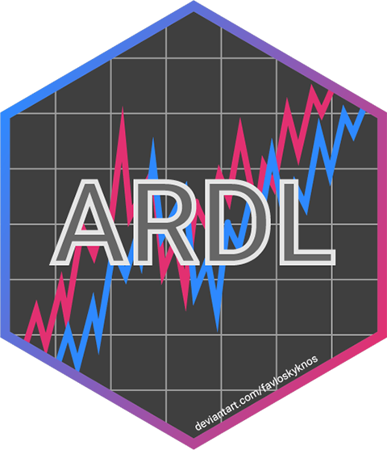
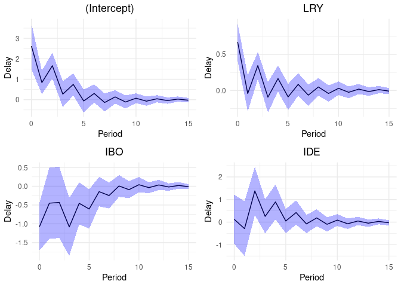
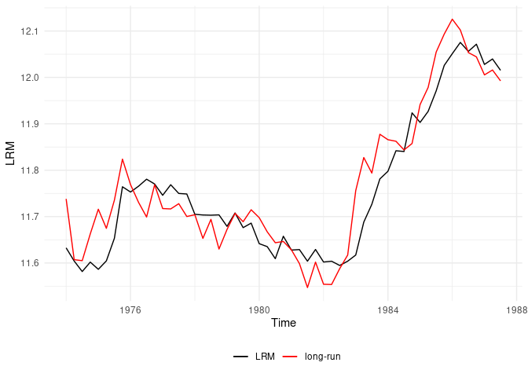
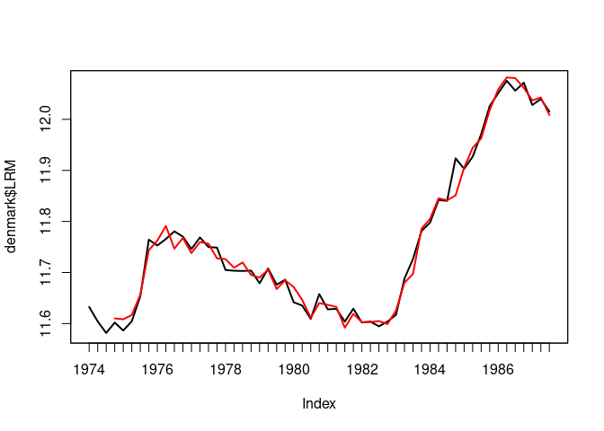

<!-- README.md is generated from README.Rmd. Please edit that file -->

# ARDL 

<!-- badges: start -->

[](https://CRAN.R-project.org/package=ARDL)
[](https://CRAN.R-project.org/package=ARDL)
[](https://lifecycle.r-lib.org/articles/stages.html#stable)
[](https://app.codecov.io/gh/Natsiopoulos/ARDL)
<!-- badges: end -->

## Overview

`ARDL` creates complex autoregressive distributed lag (ARDL) models and
constructs the underlying unrestricted and restricted error correction
model (ECM) automatically, just by providing the order. It also performs
the bounds-test for cointegration as described in [Pesaran et
al. (2001)](https://onlinelibrary.wiley.com/doi/abs/10.1002/jae.616) and
provides the multipliers and the cointegrating equation. The validity
and the accuracy of this package have been verified by successfully
replicating the results of Pesaran et al. (2001) in [Natsiopoulos and
Tzeremes
(2022)](https://onlinelibrary.wiley.com/doi/abs/10.1002/jae.2919).

## Why `ARDL`?

- Estimate complex ARDL models just providing the ARDL order
- Estimate the conditional ECM just providing the underlying ARDL model
  or the order
- Estimate the long-run, short-run, delay, and interim multipliers
- Apply the bound test for no cointegration (*Pesaran et al., 2001*)
  - Both the *F-test* and the *t-test* are available
  - The *p-value* is also available along with the *critical value
    bounds* for specific level of statistical significance
  - Exact *p-values* and *critical value bounds* are available, along
    with the asymptotic ones

## Installation

``` r
# You can install the released version of ARDL from CRAN:
install.packages("ARDL")

# Or the latest development version from GitHub:
install.packages("devtools")
devtools::install_github("Natsiopoulos/ARDL")
```

## Usage

This is a basic example which shows how to use the main functions of the
`ARDL` package.

Assume that we want to model the `LRM` (logarithm of real money, M2) as
a function of `LRY`, `IBO` and `IDE` (see `?denmark`). The problem is
that applying an OLS regression on non-stationary data would result into
a spurious regression. The estimated parameters would be consistent only
if the series were cointegrated.

``` r
library(ARDL)
data(denmark)
```

First, we find the best ARDL specification. We search up to order 5.

``` r
models <- auto_ardl(LRM ~ LRY + IBO + IDE, data = denmark, max_order = 5)

# The top 20 models according to the AIC
models$top_orders
#>    LRM LRY IBO IDE       AIC
#> 1    3   1   3   2 -251.0259
#> 2    3   1   3   3 -250.1144
#> 3    2   2   0   0 -249.6266
#> 4    3   2   3   2 -249.1087
#> 5    3   2   3   3 -248.1858
#> 6    2   2   0   1 -247.7786
#> 7    2   1   0   0 -247.5643
#> 8    2   2   1   1 -246.6885
#> 9    3   3   3   3 -246.3061
#> 10   2   2   1   2 -246.2709
#> 11   2   1   1   1 -245.8736
#> 12   2   2   2   2 -245.7722
#> 13   1   1   0   0 -245.6620
#> 14   2   1   2   2 -245.1712
#> 15   3   1   2   2 -245.0996
#> 16   1   0   0   0 -244.4317
#> 17   1   1   0   1 -243.7702
#> 18   5   5   5   5 -243.3120
#> 19   4   1   3   2 -243.0728
#> 20   4   1   3   3 -242.4378

# The best model was found to be the ARDL(3,1,3,2)
ardl_3132 <- models$best_model
ardl_3132$order
#> LRM LRY IBO IDE 
#>   3   1   3   2
summary(ardl_3132)
#> 
#> Time series regression with "zooreg" data:
#> Start = 1974 Q4, End = 1987 Q3
#> 
#> Call:
#> dynlm::dynlm(formula = full_formula, data = data, start = start, 
#>     end = end)
#> 
#> Residuals:
#>       Min        1Q    Median        3Q       Max 
#> -0.029939 -0.008856 -0.002562  0.008190  0.072577 
#> 
#> Coefficients:
#>             Estimate Std. Error t value Pr(>|t|)    
#> (Intercept)   2.6202     0.5678   4.615 4.19e-05 ***
#> L(LRM, 1)     0.3192     0.1367   2.336 0.024735 *  
#> L(LRM, 2)     0.5326     0.1324   4.024 0.000255 ***
#> L(LRM, 3)    -0.2687     0.1021  -2.631 0.012143 *  
#> LRY           0.6728     0.1312   5.129 8.32e-06 ***
#> L(LRY, 1)    -0.2574     0.1472  -1.749 0.088146 .  
#> IBO          -1.0785     0.3217  -3.353 0.001790 ** 
#> L(IBO, 1)    -0.1062     0.5858  -0.181 0.857081    
#> L(IBO, 2)     0.2877     0.5691   0.505 0.616067    
#> L(IBO, 3)    -0.9947     0.3925  -2.534 0.015401 *  
#> IDE           0.1255     0.5545   0.226 0.822161    
#> L(IDE, 1)    -0.3280     0.7213  -0.455 0.651847    
#> L(IDE, 2)     1.4079     0.5520   2.550 0.014803 *  
#> ---
#> Signif. codes:  0 '***' 0.001 '**' 0.01 '*' 0.05 '.' 0.1 ' ' 1
#> 
#> Residual standard error: 0.0191 on 39 degrees of freedom
#> Multiple R-squared:  0.988,  Adjusted R-squared:  0.9843 
#> F-statistic: 266.8 on 12 and 39 DF,  p-value: < 2.2e-16
```

Then we can estimate the UECM (Unrestricted Error Correction Model) of
the underlying ARDL(3,1,3,2).

``` r
uecm_3132 <- uecm(ardl_3132)
summary(uecm_3132)
#> 
#> Time series regression with "zooreg" data:
#> Start = 1974 Q4, End = 1987 Q3
#> 
#> Call:
#> dynlm::dynlm(formula = full_formula, data = data, start = start, 
#>     end = end)
#> 
#> Residuals:
#>       Min        1Q    Median        3Q       Max 
#> -0.029939 -0.008856 -0.002562  0.008190  0.072577 
#> 
#> Coefficients:
#>              Estimate Std. Error t value Pr(>|t|)    
#> (Intercept)   2.62019    0.56777   4.615 4.19e-05 ***
#> L(LRM, 1)    -0.41685    0.09166  -4.548 5.15e-05 ***
#> L(LRY, 1)     0.41538    0.11761   3.532  0.00108 ** 
#> L(IBO, 1)    -1.89172    0.39111  -4.837 2.09e-05 ***
#> L(IDE, 1)     1.20534    0.44690   2.697  0.01028 *  
#> d(L(LRM, 1)) -0.26394    0.10192  -2.590  0.01343 *  
#> d(L(LRM, 2))  0.26867    0.10213   2.631  0.01214 *  
#> d(LRY)        0.67280    0.13116   5.129 8.32e-06 ***
#> d(IBO)       -1.07852    0.32170  -3.353  0.00179 ** 
#> d(L(IBO, 1))  0.70701    0.46874   1.508  0.13953    
#> d(L(IBO, 2))  0.99468    0.39251   2.534  0.01540 *  
#> d(IDE)        0.12546    0.55445   0.226  0.82216    
#> d(L(IDE, 1)) -1.40786    0.55204  -2.550  0.01480 *  
#> ---
#> Signif. codes:  0 '***' 0.001 '**' 0.01 '*' 0.05 '.' 0.1 ' ' 1
#> 
#> Residual standard error: 0.0191 on 39 degrees of freedom
#> Multiple R-squared:  0.7458, Adjusted R-squared:  0.6676 
#> F-statistic: 9.537 on 12 and 39 DF,  p-value: 3.001e-08
```

And also the RECM (Restricted Error Correction Model) of the underlying
ARDL(3,1,3,2), allowing the constant to join the long-run relationship
(case 2), instead of the short-run (case 3).

``` r
recm_3132 <- recm(uecm_3132, case = 2)
summary(recm_3132)
#> 
#> Time series regression with "zooreg" data:
#> Start = 1974 Q4, End = 1987 Q3
#> 
#> Call:
#> dynlm::dynlm(formula = full_formula, data = data, start = start, 
#>     end = end)
#> 
#> Residuals:
#>       Min        1Q    Median        3Q       Max 
#> -0.029939 -0.008856 -0.002562  0.008190  0.072577 
#> 
#> Coefficients:
#>              Estimate Std. Error t value Pr(>|t|)    
#> d(L(LRM, 1)) -0.26394    0.09008  -2.930 0.005405 ** 
#> d(L(LRM, 2))  0.26867    0.09127   2.944 0.005214 ** 
#> d(LRY)        0.67280    0.11591   5.805 7.03e-07 ***
#> d(IBO)       -1.07852    0.30025  -3.592 0.000837 ***
#> d(L(IBO, 1))  0.70701    0.44359   1.594 0.118300    
#> d(L(IBO, 2))  0.99468    0.36491   2.726 0.009242 ** 
#> d(IDE)        0.12546    0.48290   0.260 0.796248    
#> d(L(IDE, 1)) -1.40786    0.48867  -2.881 0.006160 ** 
#> ect          -0.41685    0.07849  -5.311 3.63e-06 ***
#> ---
#> Signif. codes:  0 '***' 0.001 '**' 0.01 '*' 0.05 '.' 0.1 ' ' 1
#> 
#> Residual standard error: 0.01819 on 43 degrees of freedom
#>   (0 observations deleted due to missingness)
#> Multiple R-squared:  0.7613, Adjusted R-squared:  0.7113 
#> F-statistic: 15.24 on 9 and 43 DF,  p-value: 9.545e-11
```

Let’s test if there is a long-run levels relationship (cointegration)
using the **bounds test** from *Pesaran et al. (2001)*.

``` r
# The bounds F-test (under the case 2) rejects the NULL hypothesis (let's say, assuming alpha = 0.01) with p-value = 0.004418.
bounds_f_test(ardl_3132, case = 2)
#> 
#>  Bounds F-test (Wald) for no cointegration
#> 
#> data:  d(LRM) ~ L(LRM, 1) + L(LRY, 1) + L(IBO, 1) + L(IDE, 1) + d(L(LRM,     1)) + d(L(LRM, 2)) + d(LRY) + d(IBO) + d(L(IBO, 1)) + d(L(IBO,     2)) + d(IDE) + d(L(IDE, 1))
#> F = 5.1168, p-value = 0.004418
#> alternative hypothesis: Possible cointegration
#> null values:
#>    k    T 
#>    3 1000

# The bounds t-test (under the case 3) rejects the NULL hypothesis (let's say, assuming alpha = 0.01) with p-value = 0.005538.
# We also provide the critical value bounds for alpha = 0.01.
tbounds <- bounds_t_test(uecm_3132, case = 3, alpha = 0.01)
tbounds
#> 
#>  Bounds t-test for no cointegration
#> 
#> data:  d(LRM) ~ L(LRM, 1) + L(LRY, 1) + L(IBO, 1) + L(IDE, 1) + d(L(LRM,     1)) + d(L(LRM, 2)) + d(LRY) + d(IBO) + d(L(IBO, 1)) + d(L(IBO,     2)) + d(IDE) + d(L(IDE, 1))
#> t = -4.5479, Lower-bound I(0) = -3.4430, Upper-bound I(1) = -4.3799,
#> p-value = 0.005538
#> alternative hypothesis: Possible cointegration
#> null values:
#>    k    T 
#>    3 1000

# Here is a more clear view of the main results.
tbounds$tab
#>   statistic Lower-bound I(0) Upper-bound I(1) alpha     p.value
#> t -4.547939        -3.442978        -4.379886  0.01 0.005538316
```

Here we have the short-run and the long-run multipliers (with standard
errors, t-statistics and p-values).

``` r
multipliers(ardl_3132, type = "sr")
#>          Term   Estimate Std. Error    t value     Pr(>|t|)
#> 1 (Intercept)  2.6201916  0.5677679  4.6148990 4.186867e-05
#> 2         LRY  0.6727993  0.1311638  5.1294603 8.317401e-06
#> 3         IBO -1.0785180  0.3217011 -3.3525465 1.790030e-03
#> 4         IDE  0.1254643  0.5544522  0.2262852 8.221614e-01
multipliers(ardl_3132)
#>          Term   Estimate Std. Error   t value     Pr(>|t|)
#> 1 (Intercept)  6.2856579  0.7719160  8.142930 6.107445e-10
#> 2         LRY  0.9964676  0.1239310  8.040503 8.358472e-10
#> 3         IBO -4.5381160  0.5202961 -8.722180 1.058619e-10
#> 4         IDE  2.8915201  0.9950853  2.905801 6.009239e-03
```

We can also estimate and visualize the delay multipliers along with
their standard errors.

``` r
mult15 <- multipliers(ardl_3132, type = 15, se = TRUE)
plot_delay(mult15, interval = 0.95)
```



Now let’s graphically check the estimated long-run relationship
(cointegrating equation) against the dependent variable `LRM`.

``` r
ce <- coint_eq(ardl_3132, case = 2)
```

``` r
plot_lr(ardl_3132, coint_eq = ce, show.legend = TRUE)
```



Forecasting and using an `ardl`, `uecm`, or `recm` model in other
functions are easy as they can be converted in regular `lm` models.

``` r
ardl_3132_lm <- to_lm(ardl_3132)

# Forecast using the in-sample data
insample_data <- ardl_3132$model
predicted_values <- predict(ardl_3132_lm, newdata = insample_data)

# Convert to ts class for the plot
predicted_values <- ts(predicted_values, start = c(1974,4), frequency=4)
plot(denmark$LRM, lwd=2) #The input dependent variable
lines(predicted_values, col="red", lwd=2) #The predicted values
```



## Ease of use

Let’s see what it takes to build the above ARDL(3,1,3,2) model.

**Using the `ARDL` package (literally one line of code):**

``` r
ardl_model <- ardl(LRM ~ LRY + IBO + IDE, data = denmark, order = c(3,1,3,2))
```

**Without the `ARDL` package:**</br> *(Using the `dynlm` package,
because striving with the `lm` function would require extra data
transformation to behave like time-series)*

``` r
library(dynlm)
#> Loading required package: zoo
#> 
#> Attaching package: 'zoo'
#> The following objects are masked from 'package:base':
#> 
#>     as.Date, as.Date.numeric

dynlm_ardl_model <- dynlm(LRM ~ L(LRM, 1) + L(LRM, 2) + L(LRM, 3) + LRY + L(LRY, 1) +
                           IBO + L(IBO, 1) + L(IBO, 2) + L(IBO, 3) +
                           IDE + L(IDE, 1) + L(IDE, 2), data = denmark)
```

``` r
identical(ardl_model$coefficients, dynlm_ardl_model$coefficients)
#> [1] TRUE
```

An ARDL model has a relatively simple structure, although the difference
in typing effort is noticeable.

Not to mention the complex transformation for an ECM. The extra typing
is the least of your problems trying to do this. First you would need to
figure out the exact structure of the model!

**Using the `ARDL` package (literally one line of code):**

``` r
uecm_model <- uecm(ardl_model)
```

**Without the `ARDL` package:**

``` r
dynlm_uecm_model <- dynlm(d(LRM) ~ L(LRM, 1) + L(LRY, 1) + L(IBO, 1) +
                                   L(IDE, 1) + d(L(LRM, 1)) + d(L(LRM, 2)) +
                                   d(LRY) + d(IBO) + d(L(IBO, 1)) + d(L(IBO, 2)) +
                                   d(IDE) + d(L(IDE, 1)), data = denmark)
```

``` r
identical(uecm_model$coefficients, dynlm_uecm_model$coefficients)
#> [1] TRUE
```

## References

Natsiopoulos, Kleanthis, & Tzeremes, Nickolaos G. (2022). ARDL bounds
test for cointegration: Replicating the Pesaran et al. (2001) results
for the UK earnings equation using R. *Journal of Applied Econometrics*,
37(5), 1079-1090. <https://doi.org/10.1002/jae.2919>

Pesaran, M. H., Shin, Y., & Smith, R. J. (2001). Bounds testing
approaches to the analysis of level relationships. *Journal of Applied
Econometrics*, 16(3), 289-326
